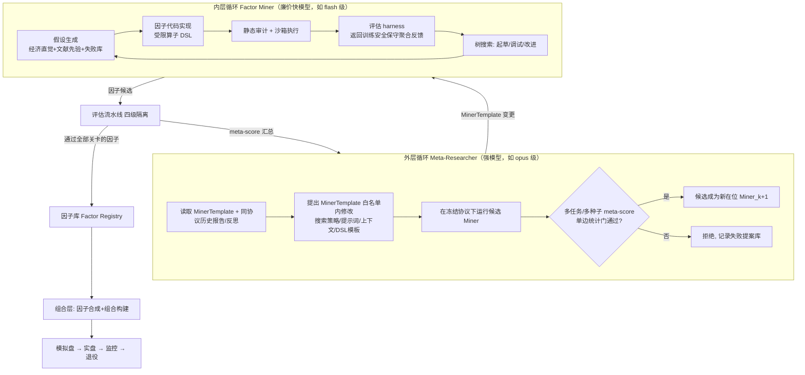

# USStockFactorFactory — 双层优化 LLM 因子挖掘工厂设计

> 机构级设计蓝图 v0.5 · 2026-08-05（Evaluation Protocol V4 + 双层反馈契约）
> 灵感来源：Weco AIDE²（bi-level autoresearch）× 机构因子投研全生命周期
> 定位：独立系统；历史已停任务与旧协议产物只读保留，当前协议另起可比较血缘

---

## 0. 设计原则

1. **过拟合是头号敌人**。数据按"谁的优化信号"四级隔离（INNER_PUBLIC / META_TRAIN / META_HOLDOUT / FACTOR_VAULT）：凡被某循环反复查询的分数所在数据层，对该循环即诚实降级为"自适应训练证据"，不再冒充样本外。
2. **固定预算作为选择压力**。每次评估限定 LLM 花费 + 计算时间，逼迫算法性创新而非暴力搜索。
3. **样本外数据是不可再生资源**。对隔离层的每次查询计入全局自适应试验预算；曝光过的 holdout 永久标记 `contaminated`，只能由下一代协议替换。
4. **一切皆代码、一切可审计**。因子 = 代码 + 元数据 + 完整血统（lineage）；每个实验强制保存 `data/protocol/code/model/prompt/seed` 六元指纹；审计日志带哈希链。
5. **协议不可变**。评估协议按 `ProtocolGeneration` 世代冻结（数据快照、切分、成本、种子、评分器）；新数据只能开启下一代，跨代分数不直接比较。
6. **人类在环但不在循环内**。挖掘循环全自动运行；人类 Gate 只有 G1（协议）与 G2（资本）两个，统一定义见 §8。
7. **非平稳性是常态**。所有验证按时代（era）切块，因子上线后进入持续衰减监控，退役是生命周期的正常终点。

---

## 1. 总体架构：双层优化



- **内层循环（Factor Miner）**：一个 AIDE 式树搜索智能体，输入任务规格（universe、horizon、目标函数），输出因子候选（代码）。它读取 `INNER_PUBLIC + META_TRAIN` 的保守聚合评价信封：有效指标、评分组件、失败原因、改进目标和先前反思；不读取逐日明细、META_HOLDOUT 或 FACTOR_VAULT。
- **外层循环（Meta-Researcher）**：优化的不是因子，而是 **Miner 本身**——当前只允许修改声明式 `MinerTemplate` 白名单（§6），不允许自由重写可执行代码。它读取同协议的跨任务/多种子聚合报告、候选/在位差异和历史结果反思；真实能力仍由从不参与选择的 **META_HOLDOUT** 与外部保留任务事后度量（二阶泛化）。
- **反馈可证明**：每次 LLM 调用追加保存脱敏 prompt/response、prompt hash、反馈 fingerprint、协议、版本、任务、阶段、模型、延迟和错误。协议过滤与 prompt 安全检查双重阻止旧分数或封存层回灌。
- 两层使用不同的模型经济学：内层跑量用廉价快模型，外层重写用最强模型（外层 token 成本相对整个评估是小头，与 AIDE² 结论一致）。

### 1.1 与 AIDE² 的关键差异（金融特有）

| 维度 | AIDE² (代码任务) | 本系统 (因子挖掘) | 应对 |
|---|---|---|---|
| 真值稳定性 | kernel 快慢是物理事实 | alpha 会衰减、机制切换 | era 化验证 + 协议世代更替 + 上线后监控 |
| 噪声量级 | run-to-run ≈0.02–0.045 | 高一个数量级 | 更严接受门槛 + 单边 Student/Welch 检验 + 多 seed |
| holdout 可再生性 | 可重新生成任务 | 历史数据不可再生 | 全局试验预算记账 + 四级隔离 + contaminated 标记 |
| reward hacking 形态 | 骗过单元测试 | 前视偏差/幸存者偏差/成本忽略 | 因果 AsOfResearchView + 泄漏测试组 + 强制成本模型 |

---

## 2. 数据层（Layer 0）

### 2.1 数据源

标准研究面板（已就绪）：

```
/Users/jiangjingzhe/Portfolios/MultiFactorUS/data_yfinance_research/processed/daily_panel/trade_year=*/data_0.parquet
```

- 2010-06-01 ~ 2026-07-31，约 872 万行，2,896 只有效证券
- 股票池：Russell 3000 + QQQ + SPY 当前成分股并集
- 引擎：polars lazy scan + hive 分区

### 2.2 口径纪律（硬约束，写入评估 harness，智能体无法绕过）

- **信号计算**：只允许前复权字段（`open/high/low/close/adj_close`）与量额（`vol/amount`）。
- **成交模拟**：只允许 **下一交易日** 未复权 `raw_open`；用 `can_buy_open_proxy`/`can_sell_open_proxy` 约束可成交性。
- **样本过滤**：`is_tradable_observation` 为基础过滤；`is_valid_ohlc`、`is_security_identity_consistent` 参与质量门。
- **禁止**：同一收益区间同时进入信号与执行；使用未来函数（评估器强制 t 日信号 → t+1 开盘成交 → t+1..t+h 收益）。

### 2.3 AsOfResearchView（智能体唯一的数据入口，诚实标记为非 PIT）

本面板是"2026 年成分股回看历史"的 yfinance 快照，**不是 PIT 数据**：滚动流动性筛选无法恢复已退市/已被指数剔除的股票，幸存者偏差在本数据源内不可修复，只能诚实披露。因此接口不叫 PIT——`AsOfResearchView` 承诺**因果性**（as-of 截断，不见未来行），不承诺**时点成分**（当日真实可投资集合）。

```python
class AsOfResearchView:
    """因果截断的研究视图。保证不见未来行, 不承诺 PIT 成分。"""
    data_snapshot_hash: str      # 数据快照指纹, 进实验六元指纹
    provider_revision: str       # 上游 source_batch / revision_id
    knowledge_time: str          # 面板构建时点
    universe_policy: str         # universe 构建规则的版本化标识
    pit_quality: str = "non_pit_current_constituents"
    production_eligible: bool = False   # 本数据源结论不可直接作为实盘依据

    def history(self, fields: list[str], lookback: int) -> pl.DataFrame: ...
    def universe(self, date: str) -> list[str]: ...   # 按当日 amount 流动性排名, 规则版本化
    def calendar(self) -> list[str]: ...
```

- 六项元数据**强制携带**，评估报告自动注入；`production_eligible=false` 意味着任何因子晋级 `production-candidate` 前必须用第二数据源复核。

### 2.4 公司行动账本（当前实现与边界）

`step_event_v1` 用未复权 `raw_open/raw_close` 成交和逐日盯市，并在开盘成交前按
`adjustment_factor` 的变化调整持仓股数，避免拆并股造成机械性净值断点。

当前研究面板没有可把拆股、现金分红和送转逐项拆开的公司行动事件表，因此引擎只能把这一调整明确标记为
`split_dividend_reinvestment_proxy`。这能保持研究序列的经济敞口连续，但不是经纪商级现金分红账本；
在接入独立公司行动源并完成逐项现金流回归前，结果继续标记为 `NON_PIT_RESEARCH`。

成交资格使用 `can_buy_open_proxy/can_sell_open_proxy`；缺失开盘价、代理不可成交、
资金不足或成交量参与率受限时，DAY 订单会拒绝或部分成交，不会静默按理论价格补齐。
完整事件顺序、费用与交割单检查见
[`docs/BACKTEST_PROTOCOL_V1.md`](docs/BACKTEST_PROTOCOL_V1.md)。

---

## 3. 因子表示层（Layer 1）

### 3.1 受限算子 DSL + 沙箱 Python 双轨

**轨道 A — 表达式 DSL**（默认，可静态审计）：

```
rank(ts_corr(close, vol, 20)) * (-1)
zscore(ts_sum(amount, 5) / ts_mean(amount, 60))
```

- 算子白名单：`ts_mean/ts_std/ts_rank/ts_corr/ts_delta/delay/rank/zscore/winsor/...`
- 所有时序算子只能向后看（`delay(x, d), d >= 1` 隐含在评估对齐里）
- 好处：可解析、可去重（表达式规范化 + 语法树哈希）、可证明无前视

**轨道 B — 沙箱 Python 函数**（进阶，复杂逻辑）：

```python
def factor(view: AsOfResearchView) -> pl.DataFrame:   # 返回 [trade_date, ts_code, value]
    ...
```

- 只能通过 `AsOfResearchView` 拿数据；独立容器执行（无网络、无凭证、只读数据挂载、限内存/CPU 时间）
- 静态审计器（AST 扫描）：禁 `import` 黑名单、禁文件系统、检测可疑的日期偏移操作

### 3.2 因子元数据 Schema

```yaml
factor_id: F-2026-000123          # 不可变
name: vol_price_divergence_20d
track: dsl | python
expression / code_hash: ...
hypothesis: "成交量与价格背离预示反转..."   # LLM 生成, 必填
lineage: {parent: F-..., miner_version: M-47, outer_step: 63}
task_spec: {universe: liquid1500, horizon: 5d, objective: long_short}
status: generated → semantic-valid → public-leading → library-admitted
        → public-gate-pass → vault-pass → paper → production-candidate
        → live → decaying → retired
fingerprint: {data_snapshot, protocol_generation, code, model, prompt, seed}  # 六元指纹, 必填
```

---

## 4. 评估流水线（Layer 2）—— 系统的心脏

> 当前运行协议：`v4.0 / NON_PIT_RESEARCH`。按当前研究要求，PIT 不进入评分，
> 但来源标签仍保留；任何 F5 只表示通过非 PIT 的执行可行性评价，不是生产批准。

### 4.1 四级数据隔离 + 不可变协议世代

核心原则：**凡被某个循环反复查询的分数，其数据层对该循环就不再是样本外**，必须诚实标记。

```
2010-06 ────────────── 2019-12 │ 2020-01 ── 2022-12 │ 2023-01 ── 2024-12 │ 2025-01 ── 2026-07
      INNER_PUBLIC             │     META_TRAIN      │    META_HOLDOUT     │    FACTOR_VAULT
```

| 层 | 谁可见/可优化 | 用途 | 诚实定性 |
|---|---|---|---|
| **INNER_PUBLIC** | 内外层可见聚合反馈 | 因子挖掘的训练信号；约 6 个月一个 era，报告 era 分布 | 自适应训练证据 |
| **META_TRAIN** | 内外层仅可见保守聚合，不见逐日明细 | discovery 的跨层保守门、外层接受/拒绝 Miner 版本的依据 | **双层循环的自适应训练证据**，不冒充 OOS |
| **META_HOLDOUT** | Miner/外层不可见；研究员审计可见 | 生成冻结的实盘排序分，度量二阶泛化 | 外层的真样本外 |
| **FACTOR_VAULT** | Miner/排序公式不可见 | 一次性晋级封印及“排序能否预测后续费后盈利”的校准目标 | 因子的终审样本外 |

- **ProtocolGeneration（不可变协议世代）**：每代冻结 `{数据快照哈希, 切分边界, 成本参数, 种子, 评分器版本}`。同代内所有 Miner 版本在完全相同协议下比较；新数据只能开启下一代 G(n+1)，跨代分数不直接比较；曝光过的 holdout 时段在后续世代永久标记 `contaminated`，不得再充当任何隔离层。**没有滚动切分**——滚动会让历史 private 反馈渗入模型上下文并破坏同协议可比性（v0.1 方案已废弃）。
- **二阶泛化的外部证据**（对齐 AIDE² 方法论）：META_HOLDOUT 之外，Miner 版本还须在**从未参与外层选择的外部保留任务**（不同 universe 构建规则、不同 horizon）上事后评测，写入泛化报告。
- **证券迁移稳健性测试**（自 v0.1 的"横截面 OOS"降级而来）：按行业/市值/证券身份做**确定性**分组切分，检验因子在未见证券组上的迁移能力。两组股票共享同一市场冲击与幸存者偏差，**不计作独立 OOS**，仅作稳健性证据。

### 4.2 指标体系

**V4 的核心变化**：搜索发现、实盘排序和最终校准使用三个不同目标。挖掘循环只能读取
`INNER_PUBLIC + META_TRAIN` 的 discovery score；研究员显式审计后，系统用
`PUBLIC + META_TRAIN + META_HOLDOUT` 生成 0–100 的 pre-vault 实盘排序分。
`FACTOR_VAULT` 的具体收益数值不进入排序公式，只提供通过/失败封印，并在因子样本足够时检验
冻结排序与 Vault 费后收益的 Spearman、Top/Bottom 组盈利率和分组单调性。所有审计结果都不回流 Miner。

V4 延续真实目标权重换手：在与预测周期一致的非重叠调仓点生成
实际目标权重并计算双边交易额 `Σ|w_t-w_{t-1}|`；离开股票池的持仓也按归零计入。
报告同时给出每次调仓、单边与日均等效换手。A股纯多头同时报告绝对净收益与相对等权基准的主动收益；
美股多空拆分 long leg、short leg、双边换手、交易成本和借券成本代理。

每层统一保存：

- 方向调整后的 RankIC、ICIR、IC 命中率、Newey-West t/p；
- 费前、费后、主动收益的年化、Sharpe、Sortino、最大回撤、Calmar、尾部损失；
- 分位数组合单调性、top-bottom spread、era/年度稳定性；
- 实际持仓换手、成本压力矩阵、目标资本占 ADV 的参与率代理、组合市场 Beta/相关性；
- 覆盖率、有效样本量和明确的失败原因。
- 费后收益 HAC t、概率 Sharpe、90% 收益/Sharpe 下置信界、成本盈亏平衡 bps；
- 按费后结果计算的 era/年度盈利率、最差 era Sharpe 和训练到 HOLDOUT 的 Sharpe 保持率；
- 预声明试验次数对应的多重检验门槛；高 ICIR 不能补偿负收益下界或不足的成本缓冲。

准入采用硬门与最弱环节约束，而非让高 ICIR 抵消负费后收益：

```
F1 discovery_only
F2 research_pass
F3 oos_pass
F4 paper_candidate
F5 live_candidate_non_pit
```

任一层发生方向反转、HAC 显著性不足、费后收益非正、成本压力失效、
回撤/换手超限、多空市场 Beta 超限、单调性或 era 稳定性不足，均停止晋级并保存原因。

**Discovery feedback（Miner/外层可见的优化信号）** — INNER_PUBLIC 与 META_TRAIN 的保守聚合：

- 两层中较差的方向调整 ICIR、费后组合 Sharpe、收益/Sharpe 下置信界、era 一致性、
  盈利 era 比例、分位单调性、压力成本 Sharpe 和成本缓冲；
- 两层中较差覆盖率、较高换手和较差 HAC 显著性；
- 固定的 V4 组件分、硬失败原因与对应改进目标。原始分层逐日序列不进入 prompt。

**原始层指标（只存库）** — PUBLIC/META_TRAIN 各自完整指标：

```
gate_score = cost_adjusted_ICIR
           × era_consistency_penalty      # era 间 IC 符号一致率 < 60% 重罚
           × redundancy_penalty           # 与在库因子最大 |corr| > 0.7 重罚
           × capacity_penalty             # 换手×成本后收益为负则归零
```

- 成本模型强制介入：佣金 + 半价差（按 `amount` 流动性分档）+ 冲击（平方根模型简版）
- 多空任务额外计入做空摩擦：借券费率分档代理（按流动性/市值）、shortable 代理（低价/微盘剔除）、locate 失败与 recall 的保守折减；无真实历史借券数据前取保守分位并在报告披露
- 收益口径：§2.4 公司行动账本（未复权成交 + 股数调整 + 现金分红 + 前复权收益盯市交叉校验）

**Meta-score（外层循环优化目标）**：

```
seed_score = mean_task(best_discovery_score_in_fixed_budget)
meta_score = mean_seed(seed_score)
```

候选与在位者使用同一个步前冻结历史反馈基线；每个 seed 只追加读取自己的新节点，不能从其他 seed
继续学习。候选必须完整跑完预声明 seed 数、均值更高且单边检验 p 值低于阈值才接受。
该分数被外层反复优化，**定性为自适应训练证据**；Miner 的真实泛化由
META_HOLDOUT + 外部保留任务事后报告。

### 4.3 多重检验控制（机构级核心）

**统计量与零假设（显式定义）**：

- 检验统计量：era 级 RankIC 序列的 t 统计量 `t = mean(IC_era) / (std(IC_era)/√N_era)`（以 era 为聚合单位，缓解日度自相关）
- H₀：因子在评估时段的真实期望 RankIC ≤ 0（反向因子对称检验）
- **有效试验数**：相关试验不按名义次数计。用试验间因子值相关矩阵估计有效独立试验数 `N_eff`（特征值法，López de Prado），p 值按 `N_eff` 做 Šidák 型收缩——即 Rank-IC 版的 deflated 检验

**全局自适应试验预算（统一记账，防规避）**——以下全部计入同一本账；**家族边界由因子值相关聚类确定，不采用申报的 lineage**（否则可通过新建根节点重置家族）：

1. 因子变体、参数扰动、方向翻转、组合表达式
2. 每个 Miner 版本 × Harness 版本的每次评估
3. 人工手动重跑
4. 每次对 META_TRAIN / FACTOR_VAULT 的查询

- **试验登记簿**：每次评估记入 `trials` 表（因子值哈希、协议世代、时段、统计量），append-only + 哈希链。
- **族内 FDR**：按相关聚类家族做 Benjamini–Yekutieli（任意相关结构下仍有效），控制族内 FDR ≤ 10%。
- **查询预算**：每协议世代对各隔离层设查询限额，超支候选排队至下一世代。

### 4.4 接受门槛（对应 AIDE² 的 ~90% 拒绝率）

因子晋级需逐级满足：

- **`public-gate-pass`**：META_TRAIN 上 cost-adjusted ICIR > 阈值（如 0.3）、era 一致率 ≥ 60%、无单一 era 贡献 > 40% 收益
- 与因子库现存因子（含已退役）最大 |spearman corr| < 0.7
- `N_eff` 收缩后 p < 0.05 且族内 FDR 通过
- 静态审计 + **泄漏测试组**全部通过（见下）
- **`vault-pass`**：FACTOR_VAULT 一次性仲裁同号且显著

**泄漏测试组**（替代 v0.1 的"延迟 1 天 IC 应下降"——慢变量因子延迟后 IC 几乎不变属正常，旧测试既误杀稳定因子也抓不住真未来函数）：

1. **前缀截断不变性**：只喂 t 日之前的数据重算 t 日信号，须与全量计算逐位一致
2. **未来哨兵字段**：视图注入带毒"未来值"哨兵列，因子输出与哨兵相关即判死
3. **负 shift / 中心窗口拦截**：DSL 层静态禁止；Python 轨道由 as-of 重放动态拦截
4. **as-of 重放**：随机抽 K 个交易日用截断视图重放全流程，输出须与批量计算一致（全量 vs 逐日增量一致性）
5. **日期置乱 / 标签置乱**：置乱未来收益后 IC 应退化为噪声；不退化说明评估管道自身泄漏

---

## 5. 内层循环：Factor Miner 智能体（Layer 3）

起点 Miner₀ = AIDE 式树搜索，节点 = 因子候选：

- **操作算子**：`draft`（新假设→新因子）、`debug`（修复执行错误）、`improve`(变异/精炼在位最优)、`combine`（对高分低相关节点做表达式组合）
- **假设生成上下文**：任务规格 + 数据字典 + 文献先验摘要（动量/反转/量价/波动率/流动性等经典族）+ **失败因子库摘要**（负样本，防重复发明）
- **搜索策略**（Miner₀ 用简单贪心，留给外层去进化）：先 5 个多样化 draft，之后贪心改进全局最优或修复随机 bug 节点
- **上下文管理**：初版朴素全历史，预期外层循环会像 AIDE₈₅ 一样进化出激进压缩
- **内置纪律提示**（初版人工写，外层可改写）：要求每个因子先陈述经济假设再写代码；禁止针对特定 era 的 if-date 逻辑

**任务篮子（异质性 = 泛化压力）**：

| 任务 | universe | horizon | 目标 |
|---|---|---|---|
| T1 | 流动性 Top500 | 5d | 多空 RankIC |
| T2 | 流动性 501–1500 | 10d | 多空 RankIC |
| T3 | Top1500 | 20d | 费后多头超额 |
| T4 | Top500 | 1d | 高换手费后可存活性 |

**预算**：每次 Miner 评估（= 在全部任务上跑完一轮挖掘）限定美元预算（LLM token 计价 + 计算时长折价），如 $15/任务，超支即中止计分。

---

## 6. 外层循环：Meta-Researcher（Layer 4）

- **对象（当前）**：声明式 `MinerTemplate` 白名单——system/draft/improve/context/diversity 文本、
  上下文样本数量、仅影响示例排序的权重和真实进入 prompt 的 DSL 结构模板。**评估器、权威分数、
  数据接口、封存层、门禁与审计模块只读**。自由代码重写推迟到容器级隔离 + 行为测试套件成熟之后（P4）
- **一步 = 一次 MinerTemplate 变更 + 一次冻结协议下的全任务篮子评估**；候选与在位使用共同冻结
  历史上下文，多 seed 独立增量，只有完整预算、均值改善和单边统计门同时通过才接受
- **评估协议**：
  - 每个候选 Miner 跑预声明 seeds × 任务篮子；同时重测时用单边 Welch t，冻结在位分时用单样本 Student t
  - noise band 由在位 Miner 的重复运行方差估计（预算内定期重测）
- **失败提案库**：所有被拒绝的重写连同其 meta-score 存档——既是外层的负样本上下文，也是研究资产（对应 AIDE² 2.5 节）
- **点火测试（远期）**：当某个进化出的 Miner_k 表现稳定超过在位者，可实验性地把它装进外层席位，检验三阶泛化

**外层专属防护**：

- 外层的优化信号只来自 META_TRAIN 的聚合分布摘要（非逐日明细），且该层已诚实定性为外层训练集；META_HOLDOUT 与外部保留任务从不进入外层选择回路，只做事后报告（审计日志可证明）
- 外层永远接触不到 FACTOR_VAULT
- 外层提交的 MinerTemplate 变更经 schema 校验 + 静态审计；任何触碰只读模块的提案直接拒绝并记录
- 每步决策后生成 `supported/refuted/inconclusive` 结果反思，保存证据、经验、避免模式、
  下一项单变量实验与停止条件，下一轮只能读取同协议反思

---

## 7. 组合与生产层（Layer 5）

### 7.1 因子合成

- `vault-pass` 因子进入合成候选池
- 合成器：从等权 zscore 起步 → 岭回归 → LightGBM（era-wise purged CV，embargo ≥ horizon）
- 合成层自身也是一个可被外层优化的"任务"（远期）

### 7.2 组合构建与回测

- 事件驱动回测器（与评估 harness 共享成交/成本代码路径——**同一份代码**，避免研究/生产口径漂移）
- 约束：单票权重上限、行业/市值中性可选、换手率约束、ADV 参与率上限（容量）
- 执行：t 日收盘后出目标权重 → t+1 `raw_open` 成交，`can_buy/sell_open_proxy` 不满足则顺延

### 7.3 模拟盘 → 实盘 → 监控 → 退役

```
public-gate-pass ──FACTOR_VAULT 一次性仲裁──> vault-pass ──> paper (≥1 季度)
paper ──实现 IC 与回测 IC 落差 < 40% + 第二数据源复核──> production-candidate
production-candidate ──人类 Gate G2: 资本分配──> live
live ──滚动 6 个月 IC 显著性监控──> decaying ──> retired (归档, 永久留在去重库)
```

- 监控指标：滚动 RankIC 及其 t 值、实现换手 vs 预期、成本实现 vs 模型、拥挤度代理（因子收益与同族因子相关性上升）
- 退役因子不删除：留在 registry 供去重与"复活检测"（衰减因子若在新机制下恢复，可重新申请验证）

---

## 8. 治理与审计（Layer 6）

- **人类 Gate（全文统一定义，以本节为准）**：
  - **G1 协议 Gate**：ProtocolGeneration 的创建/更替；评估器、门禁、审计代码的任何修改——含外层提出的"评估 bug 修复"类 patch（AIDE² 出现过此类涌现行为，必须人工 review 后手动合入）
  - **G2 资本 Gate**：`production-candidate → live` 及后续资本增减
  - 其余环节全部无人值守；G1/G2 之外不存在其他人类审批点
- **防篡改审计日志**：append-only 不自动等于防篡改。事件表带哈希链（每条记录含前一条哈希）、单写者事务化写入（DuckDB WAL）、并发评估经队列串行落账、快照定期锚定到外部存储
- **可解释性要求**：晋级 `vault-pass` 的因子必须附带 LLM 生成 + 人类可读的假设说明和归因报告（分年度/分行业/分市值收益拆解）；无法解释的因子可以进库但资本上限减半
- **进化代码的可维护性**（AIDE² 3.2 节教训）：外层重写的 Miner 以模块为黑盒 + 强制接口契约（类型化 I/O、行为测试套件），不追求人类读懂每一行

---

## 9. 工程实现

### 9.1 目录结构

```
USStockFactorFactory/
├── DESIGN.md
├── pyproject.toml
├── src/factor_factory/
│   ├── data/            # AsOfResearchView, 公司行动账本, universe 构建, 日历
│   ├── protocol/        # ProtocolGeneration 世代冻结/校验/contaminated 标记
│   ├── dsl/             # 表达式解析/算子库/规范化哈希
│   ├── sandbox/         # Python 轨道沙箱执行 + AST 审计器
│   ├── eval/            # 评估 harness: 切分/指标/成本模型/多重检验记账
│   ├── miner/           # 内层智能体 (被外层重写的对象, 独立子包)
│   ├── meta/            # 外层智能体 + 接受门 + noise band 估计
│   ├── registry/        # 因子库/试验登记簿/lineage (DuckDB)
│   ├── portfolio/       # 合成/组合构建/事件驱动回测
│   ├── monitor/         # paper/live 监控, 衰减检测
│   └── budget/          # LLM 与计算成本计量
├── tasks/               # 任务篮子规格 (yaml)
├── runs/                # 每次运行的不可变产物
└── tests/
```

### 9.2 技术栈

- **数据/计算**：polars（惰性扫描 hive 分区）、DuckDB（registry + 审计日志）、numpy/scipy（统计检验）
- **LLM**：内层廉价快模型，外层最强模型；统一经由带计费表的 client 封装（预算硬中止）
- **执行隔离**：DSL 轨道无任意代码执行；Python 轨道 P0 起即用独立容器（无网络、无凭证、只读数据挂载、内存/CPU/时长限额），subprocess 仅作容器不可用时的本地开发降级模式
- **编排**：单机异步队列起步（asyncio + 文件锁），任务粒度天然并行（因子评估相互独立）

### 9.3 分阶段路线图

工程验收使用**植入合成因子与确定性基准**，不以挖到真 Alpha 为条件——否则会反向鼓励系统消耗隔离层预算或放宽门槛。

| 阶段 | 交付 | 验收标准（工程验收） |
|---|---|---|
| **P0 评估地基** | 不可变协议 + AsOfResearchView（非 PIT 诚实标记）+ 公司行动账本 + DSL + 四级隔离评估 harness + 试验记账 + registry | 植入已知强度的合成信号, 管道按预期强度回收; 零信号哨兵因子全部被拒; 人为注毒因子被泄漏测试组 100% 拦截; 20 个手写经典因子指标与确定性基准逐位复现; 拆股/分红样例账本与手工核算一致 |
| **P1 内层循环** | Miner₀ (树搜索 + LLM) + 预算计量 + 任务篮子 | 无人干预 24h 运行零崩溃; 预算硬中止生效; 全部产物带六元指纹; 对植入合成信号的数据集能稳定发现该信号。**真实数据上零因子过门 = 完全成功的运行** |
| **P2 外层循环** | Meta-Researcher + HarnessSpec 白名单接受门 + 失败提案库 | 同代同协议可比性成立; 接受门统计正确（对构造的已知优劣 Miner A/B 能正确识别更优者）; META_HOLDOUT 从未进入选择回路（审计日志可证） |
| **P3 组合与生产** | 合成器 + 组合回测 + paper 监控 | 回测与评估共用成交代码路径的一致性测试通过; paper 监控指标齐全。费后 IR 为正是研究目标, 不是工程验收条件 |
| **P4 进阶** | 点火测试 / PIT universe 数据源 / 外层自由代码重写（容器+行为测试成熟后）/ 合成层进外层 | — |

### 9.4 运行时可观测性与排障契约

- HTTP 中间件为每个请求返回 `X-Request-ID` 与 `Server-Timing`，并在有界内存窗口中统计路由级
  请求数、4xx/5xx、P50/P95/P99 和最大延迟；动态 ID 会归一化，避免指标基数失控。
- 每个研究 worker 暴露真实阶段、当前 task/op/seed、内层预算进度、外层步、心跳年龄、最近进度、
  asyncio task 状态和脱敏异常。长时间无心跳是告警，不会自动重启或修改研究数据。
- 面板注册表仅做文件清单和身份哈希，不因诊断请求触发全量加载；另行报告加载状态、耗时、行数、
  证券数、日期范围与 Polars 估算内存。
- PostgreSQL 诊断包括探针延迟、连接池占用及各类持久化记录数量；回测产物报告运行数、文件数、
  总字节和最近修改时间。
- `/api/health/live` 只回答进程事件循环是否可服务；`/api/health/ready` 还要求数据库和当前任务面板
  来源可达；`/api/metrics` 是 Prometheus 文本面，`/api/observability` 是诊断台和故障交接使用的
  结构化脱敏快照。
- 禁止采集请求体、DSL 原文、持仓/选股结果或凭据；配置键、日志和事件 payload 在出诊断边界前统一
  脱敏。健康状态仅代表工程链路，没有任何因子或回测的实盘批准含义。

---

## 10. 已知风险清单（诚实披露）

1. **幸存者偏差**：universe 为当前成分股并集，早年回测系统性乐观。缓解见 §2.3，根治需 PIT 成分股数据。
2. **单一数据源**：yfinance 复权/拆分错误会污染全链路。`adjustment_ratio_spread` 与身份检查字段已提供第一道防线；建议对晋级因子用第二数据源抽查。
3. **META_TRAIN 的慢性拟合**：外层长期观察 meta-score 必然逐步拟合该层——设计上已诚实定性为训练证据而非 OOS；真实泛化以 META_HOLDOUT + 外部保留任务 + FACTOR_VAULT 三道事后证据为准。
4. **费后容量幻觉**：日线 + 开盘成交的成本模型偏乐观，尤其小市值。中小市值任务的成本参数取保守分位。
5. **做空摩擦近似**：无真实历史借券费/可空名单，多空任务空头侧按保守代理折减，小市值空头敞口的结论尤其存疑。
6. **进化代码不可维护**：接受它，用 HarnessSpec 白名单 + 接口契约管理（§6/§8），不投入人力读懂每行。
